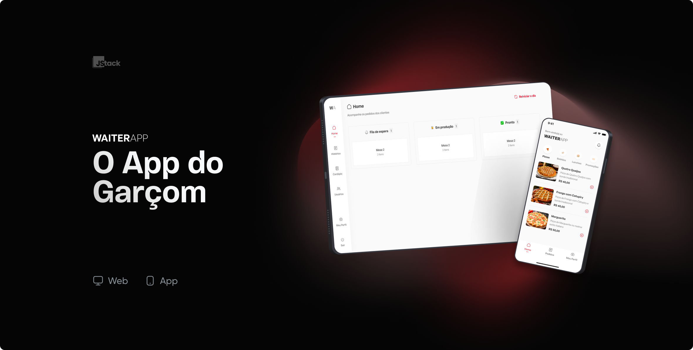

# WAITERAPP - O APP do Garçom

É um sistema completo que permita a um garçom anotar pedidos dos clientes através de um aplicativo mobile, enviando essas informações diretamente para um dashboard de gestão do restaurante. Esse dashboard será acessível pela gerência ou pela cozinha para acompanhar o andamento dos pedidos, atualizar o status e gerar relatórios.

## Stack utilizada

**Front-End:**
        React
        Styled-Components
        Typescript(TSX)
        Axios
        Socket-io
        React-Toastify

**Mobile:**
        React-native
        ,Expo
        , Styled-Components
        , Styled-Components/Native
        , Typescript(TSX)
        , Axios
        , Expo-font
        , React-native-svg

**BackEnd:**
        NodeJS
        , Express
        , Socket-io
        , Multer
        , Mongoose
        , Typescript

**Banco de dados:**
        MongoDB
